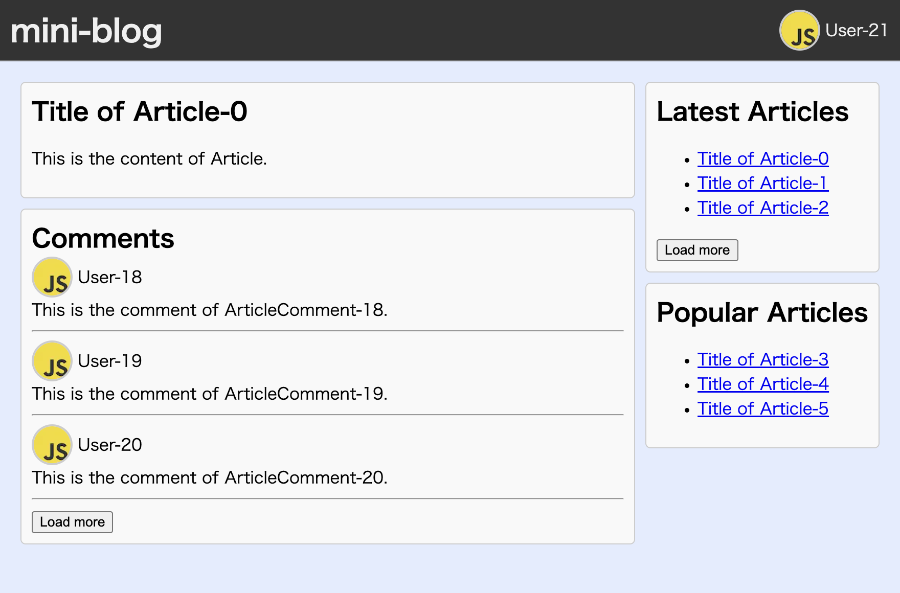

# poc-nextjs-app-router-relay

This is a PoC for combining Next.js App Router and Relay.



## Background

As of April 2024, there is an official example combining Next.js App Router with Relay.

- https://github.com/relayjs/relay-examples/tree/b6f9b199d0b8027b5a76a11f1821631b216f4df4/issue-tracker-next-v13

However, this example is mostly composed of Client Components. This is because it uses [`useFragment`](https://relay.dev/docs/api-reference/use-fragment/) for [data masking](https://relay.dev/docs/tutorial/fragments-1/#step-3--call-usefragment). `useFragment` is a React Hook and cannot be used in Server Components. Therefore, most of the component tree must be made up of Client Components.

This PoC demonstrates how to combine Next.js App Router with Relay while keeping more components as Server Components.

## Requirements

- Node.js
- [watchman](https://facebook.github.io/watchman/docs/install)

## How to run

```console
$ npm i
$ npm run gen
$ npm run dev
$ open http://localhost:3000
```

## Concept

### Use `readInlineData` instead of `useFragment`

With [`readInlineData`](https://relay.dev/docs/api-reference/graphql-and-directives/#inline), you can achieve data masking similar to `useFragment`. Additionally, `readInlineData` can be used in Server Components as it is not a React Hook. Therefore, this PoC uses `readInlineData` as much as possible.

- https://github.com/mizdra/poc-nextjs-app-router-relay/blob/main/app/SideBar/index.tsx

### Use `fetchQuery` instead of `loadSerializableQuery` and `usePreloadedQuery`

In the official example, query data is fetched as follows:

1. Fetch the query on the Server Component using [`loadSerializableQuery`](https://github.com/relayjs/relay-examples/blob/b6f9b199d0b8027b5a76a11f1821631b216f4df4/issue-tracker-next-v13/src/relay/loadSerializableQuery.ts#L22C31-L22C52)
   - The query result are converted to a serializable format for passing to the Client Component.
2. Pass the query result to the Client Component.
3. Deserialize the query result on the Client Component using [`useSerializablePreloadedQuery`](https://github.com/relayjs/relay-examples/blob/b6f9b199d0b8027b5a76a11f1821631b216f4df4/issue-tracker-next-v13/src/relay/useSerializablePreloadedQuery.ts#L16) to get a `PreloadedQuery`.
4. Pass the `PreloadedQuery` to [`usePreloadedQuery`](https://relay.dev/docs/api-reference/use-preloaded-query/) to access the query data (`FooQuery$data`).
5. Use `useFragment` in the Client Component to read the query data.

This approach requires the use of `usePreloadedQuery', which requires client components.

Instead, in this PoC, query data is fetched as follows:

1. Fetch the query on the Server Component using [`fetchQuery`](https://relay.dev/docs/api-reference/fetch-query/).
   - This allows you to get the data (`FooQuery$data`) of the query.
   - The query data is serializable and can be passed to the Client Component.
2. Pass the query data from the Server Component to the Client Component.
3. Read the query data on the Server Component using `readInlineData`.

This allows the Server Component to fetch queries and read data.

### Write query results to Relay store instead of `QueryResponseCache`

In order for the Client Component to also read the query data fetched by the Server Component, it must be cached in a location accessible by the client.

The official example uses `QueryResponseCache` to cache the query data. However, the code is a bit more complex.

- https://github.com/relayjs/relay-examples/blob/b6f9b199d0b8027b5a76a11f1821631b216f4df4/issue-tracker-next-v13/src/relay/environment.ts#L59C14-L64
- https://github.com/relayjs/relay-examples/blob/b6f9b199d0b8027b5a76a11f1821631b216f4df4/issue-tracker-next-v13/src/relay/environment.ts#L72-L80
- https://github.com/relayjs/relay-examples/blob/b6f9b199d0b8027b5a76a11f1821631b216f4df4/issue-tracker-next-v13/src/relay/useSerializablePreloadedQuery.ts#L42-L53

In this PoC, we cache query data in a `Store`. Store` is the standard place to cache query results in Relay. This simplifies the code.

- https://github.com/mizdra/poc-nextjs-app-router-relay/blob/main/components/RelayRecordMapPublisher.tsx
